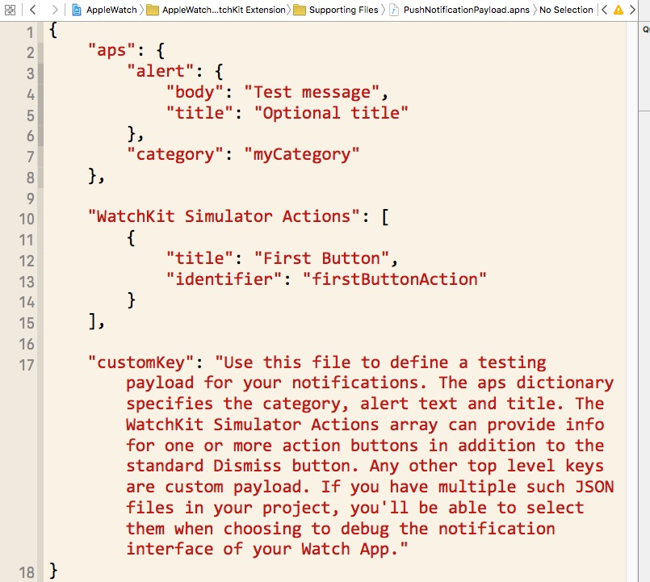

#WatchKit Programming Guide

#overView
   AppleWatch应用由两个独立的部分组成：a Watch app and a WatchKit extension. 
   WatchKit Extension 包含了管理接口、响应用户交互和更新用户接口的代码。
   watchOS1和watchOS变化比较大，watchOS1中watchKit extension运行在iPhone上watchOS2中移到了AppleWatch上了。
   
##Developing for Apple Watch

###The Glance Interface
Glance是一个用于呈现app重要信息的接口,app中不是必须有glance，但是如果有相关信息需要展示可能会包含有。glance是非滚动的,整个glance视图必须适配在一个单独的屏幕，glance中的信息是只读的，因此glance不包含按钮、开关或者其他可交互的控件。点击glance会运行你的WatchApp。

glance不是单独可执行的，而是app的一部分。glance位于你WatchApp的storyboard中,配置glance的代码在WatchKit extension中。更行glance的方法和创建WatchApp的方法一致。

###远程通知和本地通知

AppleWatch和iPhone配对工作来展示本地和远程通知。AppleWatch使用一个很小的界面(叫做short look)来展示即将接受到通知。当用户想查看更多的信息，可以使用一个更加详细的界面(叫做long look).你也可以自定义与系统提供的不同的详细界面(通知数据的图像、排序)。

AppleWatch在iOS8中自动的提供了对可操作的通知的支持，可操作的通知是一种添加按钮到你的通知界面的方式，它反映了用户可能需要的操作。例如，一个会议邀请的通知可能包含接受或者拒绝邀请的按钮.AppleWatch会自动的添加适当的按钮到通知的视图中,你所需要做的是在WatchKit extension中处理用户选择的这些动作。

###Complications

Complications是一个出现在watch表盘向用户展示重要信息的小型可见节点。Complications当用户查看时间的时候变得可见。大多数watch支持至少两个或者三个Complications，用户可以自定义哪些Complications被显示，App可以使用一个Complication来展示特别的app数据。

###设计你的用户界面

AppleWatch的本质决定了Applewatch需要不同的设计。在AppleWatch开发中，你的用户界面需要快速的展示信息，方便的导航。要创建这类界面意味着你不能简单的将现有的iOS app表现方式使用在AppleWatch上。相反的你的iOS app需要配套的AppleWatch用户界面。

##配置你的Xcode工程

一个AppleWatch app需要一个存在的iOS app。Xcode会将Watch应用和WatchKit应用扩展打包，然后放进现有的iOS应用包中。Xcode提供了一个搭建Watch应用的模板，其中包含了创建应用、glance，以及自定义通知界面所需的所有资源。该模板在现有的iOS应用中创建一个额外的Watch应用对象。（WatchKit development requires the iOS 8.2 SDK or later. ）

iOS模拟器为你提供了运行环境，你可以用来测试你的AppleWatch app。

###向iOS应用中添加Watch应用

要向现有项目中添加Watch应用对象，请执行以下操作：

1. 打开现有的iOS应用项目
2. 选择 File > New > Target，然后选中Apple Watch
3. 选择 Watch App
4. 单击 Next
5. 如果您想要使用glance或者自定义通知界面，请选择相应的选项

建议激活应用通知选项。选中之后就会创建一个新的文件来调试该通知界面。如果您没有选择这个选项，那么之后您只能手动创建这个文件了。

6. 单击 Finish

完成上述操作之后，Xcode将WatchKit应用扩展所需的文件以及Watch应用添加到项目当中，并自动配置相应的对象。Xcode将基于iOS应用的bundle ID来为两个新对象设置它们的bundle ID。比如说，iOS应用的bundle ID为`com.example.MyApp`，那么Watch应用的bundle ID将被设置为`com.example.MyApp.watchapp`，WatchKit应用扩展的bundle ID被设置为`com.example.MyApp.watchkitextension`。这三个可执行对象的基本ID（即`com.example.MyApp`）必须相匹配，如果您更改了iOS应用的bundle ID，那么您就必须相应的更改另外两个对象的bundle ID。
###应用对象的结构

Xcode中的WatchKit应用扩展模板为iOS应用创建了两个新的可执行程序。Xcode同时也配置了项目的编译依赖，从而让Xcode在编译iOS应用的同时也编译这两个可执行对象。图2-1说明了它们的依赖关系，并解释了Xcode是如何将它们打包在一起的。WatchKit依赖于iOS应用，而其同时又被Watch应用依赖。编译iOS应用将会将这三个对象同时编译并打包。
 
###编译、运行以及调试程序

当您创建完Watch应用对象后，Xcode将自行配置用于运行和调试应用的编译方案。使用该配置在iOS模拟器或真机上启动并运行您的应用。

对于包含glance或者自定义通知的应用来说，Xcode会分别为其配置不同的编译方案。使用glance配置以在模拟器中调试glance界面，使用通知配置以测试静态和动态界面。

为glance和通知配置自定义编译方案

1. 选择现有的Watch应用方案
2. 从方案菜单中选择Edit Scheme

	

3. 复制现有的Watch应用方案，然后给新方案取一个合适的名字。
比如说，命名为“Glance - My Watch app”，表示该方案是专门用来运行和调试glance。
4. 选择方案编辑器左侧栏的Run选项
5. 在信息选项卡中，选择合适的可执行对象
6. 关闭方案编辑器以保存更改
>
	watch OS2中自动生成的。

###通知

当您在iOS模拟器调试自定义通知界面的时候，您可以指定一个负载来模拟进来的通知。通知界面的Xcode模板包含一个__RemoteNotificationPayload.json(watch OS1)/PushNotificationPayload.apns(watch OS2)__文件，您可以用它来指定负载中的数据。这个文件位于WatchKit应用扩展的Supporting Files文件夹。只有当您在创建Watch应用时勾选了通知场景选项，这个文件才会被创建。如果这个文件不存在，您可以用一个新的空文件手动创建它。

负载文件包含了绝大多数您需要的键值，但是您可以根据应用程序的实际情况添加更多的键值。图2-2展示了项目中的默认JSON文件。由于iOS模拟器无法访问iOS应用的注册动作，这个负载便包含了一个名为“WatchKit Simulator Actions”的键值，其值为一个包含了一系列动作的数组。每个动作按钮含有`title`和`identifier`键，它们的值和iOS应用中注册的相应键值相同。

watch OS1

watch OS2

大多数JSON数据被打包成一个字典，在运行时提供给你的代码使用。因为模拟器没有访问你app注册的行为的权限，因此你也需要使用payload文件来指定这些触发事件的按钮显示在你的界面上。WatchKit模拟器Actions key包含了一个字典的数组，每一个代表一个添加到你界面的按钮。每个字典包含下面的这些key:

* title —按钮的标题. __required__
* identifier — 传入interface Controller `application:handleActionWithIdentifier:forLocalNotification:completionHandler:` or `application:handleActionWithIdentifier:forRemoteNotification:completionHandler:`方法的String值. __required__
* destructive — 这个key的取值为0 或者 1, 这个值会影响按钮的渲染，为1时，按钮的标题绘制成红色，0 为白色。 __optional__

>	你可以为不同的方案选择不同的payload文件

##Watch应用的体系结构

Apple Watch应用程序包含两个部分：Watch应用和WatchKit应用扩展。
两者相互作用共同工作来运行用户界面，直到用户终止。这两者的关系如何，决定于app是在何种系统版本下开发的。

 
 
 
###场景管理: The Interface Controller

每一个场景由一个WKInterfaceController实例对象管理，WatchKit中的WKInterfaceController与iOS中的UIViewController类似。它提供和管理屏幕显示的内容，响应这些内容的用户事件。与UIViewController不同的是，WKInterfaceController不管理实际的视图，这些视图被WatchKit管理着。

Watch app包含多个interface controller，每个controller展示不同类型的信息。因为同一时间Watch的屏幕只允许存在一个controller，app 呈现新的controller作为用户操作的响应。一个app的导航样式决定一个interface controller如何被呈现。如果需要app也可以呈现模态的controller。
> 
Glance和自定义通知有特定的interface controller。

###Watch App生命周期

WatchApp的用户交互决定了app的运行和它的生命周期。用户可以从主屏幕、Glance或者使用你自定义的通知界面启动watch app。任何一种方式都会运行Watch app和对应的Watch extension。watch app 和WatchKit一直传递信息，直到用户终止app，这时iOS暂停extension直到下一次用户交互。

当用户开始与Watch应用交互时，Apple Watch将会寻找一个合适的故事板场景来显示。它根据用户是否在查看应用的glance界面，是否在查看通知，或者是否在浏览应用的主界面等行为来选择相应的场景。选择完场景后，Watch OS将通知配对的iPhone启动WatchKit应用扩展，并加载相应对象的运行界面。所有的消息交流都在后台进行。

加载场景结束后，WatchKit会请求WatchKit extension创建与之对应的interface controller对象。

启动一个Watch App

在interface controller的`init`、`awakeWithContext:`方法来加载必要的数据、设置所有界面对象的值，准备好用户界面的展示。不要使用`willActivate`初始化你的interface controller。在controller显示在屏幕之前`willActivate`方法是你最后的改变你界面的机会。在watchOS 2中WatchKit会调用`didAppear `方法告知你你的interface controller实际出现在屏幕的时间。

当你的interface controller出现在屏幕上，用户操作会被你interface controller的处理方法处理。当用户触发tables、buttons、 switches、sliders、和 其他操作事件，WatchKit会自动的调用你的处理方法，以便你做出响应。使用处理方法来更新你的界面或者执行其他有关的任务。要在其他时间执行任务，你可以使用一个NStimer对象在标明的时间来运行相关的代码。
>
Glance不支持任何处理方法，点击app的Glance界面，总是启动这个app。

当用户在Apple Watch上与应用进行交互时，WatchKit应用扩展将保持运行。如果用户明确退出应用或者停止与Apple Watch进行交互，那么iOS将停用当前界面控制器，并暂停应用扩展的运行。与Apple Watch的互动是非常短暂的，因此这几个步骤都有可能在数秒之间发生。所以，界面控制器应当尽可能简单，并且不要运行长时任务。重点应当放在读取和显示用户想要的信息上来。

如果用户重启配对的iPhone，在iPhone第一次解锁之前Watch app的有些功能是无法生效的。watchOS 1编译的app在第一次解锁iPhone之前根本不会运行。watchOS 2编译的app在第一次解锁iPhone之前可以运行，但是不能和iPhone进行通信。

###与iOS App的数据共享

在watchOS 1中iOS app和WatchKit extension可以使用一个共享程序组来存储共同的数据文件。共享程序组是一个支持多个进程访问的可靠的容器，通常每个程序在它自己的沙盒环境下运行，但是共享程序组使两个程序共享一个公共的目录，用它来共享文件和userdefaults。

>在watchOS 2中iOS app 和 WatchKit extension使用Watch Connectivity framework取代共享程序组来通信。WatchKit extension仍然可以使用共享程序组来和对应的Watch app共享媒体文件

可以在iOS应用和WatchKit应用扩展中的Capabilities选项卡中启动共享程序组。激活这项功能后，Xcode将会为每个对象添加授权文件（需要的话），并给那个文件添加com.apple.security.application-groups授权。要共享数据，这两个对象必须选择相同的共享程序组。

程序运行时，您可以通过在共享容器目录中读写文件以在两个程序间共享数据。要访问容器，使用NSFileManager中的containerURLForSecurityApplicationGroupIdentifier:方法来接收该目录的根路径。使用方法返回的URL来枚举目录内容或者在目录中为文件创建新的URL。

在watchOS 2中，iOS自动的转发一份iOS app的参数拷贝给AppleWatch。WatchKit extension可以使用 NSUserDefaults读取这些参数，但是不能修改。在watchOS 1中你可以在iOS app 和WatchKit extension初始化一个和共享程序组名字相同的NSUserDefaults对象来共享参数。

###与iOS App通信
在watchOS 2中WatchKit使用Watch Connectivity framework与iOS App通信。这个framework提供了一个在两个程序间发送文件和数据字典的双向通信通道。这个framework支持在后台发送数据。

>
在watchOS 1中Watch app可以使用`openParentApplication:reply:`方法向配对的iOS app发送请求，可选的接受响应。(当使用这个方法向iOS app发送消息的时候，使用NSProcessInfo的`performExpiringActivityWithReason:usingBlock:`方法来防止WatchKit extension在消息发送之前或者反馈收到之前失效)。iOS app的代理必须实现`application:handleWatchKitExtensionRequest:reply:`方法来接收和响应消息。

##使用iOS技术

在watchOS 1中WatchKit应用扩展可以使用绝大多数iOS技术。由于应用扩展和应用还是有一些不同，因此某些技术的使用可能会受到限制，或者不受到推荐。下面是决定是否使用特定技术的准则：

* 需要注意使用某些技术必须在iPhone上面允许。用户必须允许使用特殊的系统技术比如Core Location。在WatchKit extension使用这些特殊的技术会触发iPhone上的一些提示。AppleWatch自己也会弹出一个提示，请求用户同意iPhone上面的权限请求。

* 不要使用后台执行模式的技术。WatchKit应用扩展只考虑在前台运行的情况，并且其只在用户和对应的Watch应用交互时运行。因此，支持后台运行的某些技术在WatchKit应用扩展中并不被支持。

* 避免使用需要长时间运行的技术。WatchKit应用扩展在用户停止和对应的Watch应用交互后便迅速暂停。由于与Watch应用的交互通常是短暂的，因此应用扩展可能会在请求的数据到达前暂停运行。

要使用iOS技术，其中一种解决方法是让您的iOS应用来使用这些技术。例如，在您的iOS应用中使用位置服务，而不是在WatchKit中使用这个技术。iOS应用可以收集所需的数据然后通过共享程序组来让应用扩展稍后访问。

###Handoff支持

AppleWatch支持使用Handoff创建可以在其他设备上完成的活动。使用__WKInterfaceController__的`updateUserActivity:userInfo:webpageURL: `方法来创建一个活动并通知给其他设备。

除了Glance的深度链接以外，AppleWatch不处理任何其他设备创建的活动。在你的glance interface controller中你可以使用一个activitiy 字典来指定可能对你的主app有用的信息。当用户点击glance运行app的时候，WatchKit或发送这个activity字典给你app的extension delegate或者main interface controller。信息的接收者可以使用这个字典中的信息来更新app UI

###远程控制事件和当前播放信息

AppleWatch使用远程控制事件系统来管理用户配对的iPhone上的录音或者录制的视频。当前播放信息的glance传输控制会为app当前播放内容生成远程控制事件。一个使用MPRemoteCommandCenter对象注册了事件处理的iOS app在app是"Now Playing"状态的时候会自动接收这些事件信息。你不需要在你的WatchKit extension中做额外的处理来支持这些远程控制事件。

>
作为喜欢、不喜欢或者标记命令的反馈，AppleWatch使用`localizedShortTitle`替换`MPFeedbackCommand `对象的`localizedTitle `。

当前播放Glance自动的显示iOS app上正在播放的信息，一个iOS app 使用`MPNowPlayingInfoCenter `对象提供这些信息。当你的app播放内容的时候，它应该更新`nowPlayingInfo `字典中的值。AppleWatch自动的获取这些信息，然后显示它。点击NowPlaying Glance会运行app配对的Watch app，如果可用的话。

在watchOS 2中，Now Playing Glance同样的也会直接的显示正在播放的信息(通过extended audio content支持)。Glance从正在播放的WKAudioFileAsset 和 WKAudioFilePlayerItem对象的属性中获取信息来显示。

#WatchApps

##UI概要

设计AppleWatch的起点是定义你的场景的storyboard。每一个场景定义了你app界面的一部分。你可用针对不同的设备定义不同的界面。

##组装你的场景StoryBoard

Watch apps使用和iOS app不同的布局模式。当你配置你的Watch app 界面的时候，Xcode会为你整理你添加的部件，在不同的线上垂直的堆叠它们。
在运行时，Watch 拿到那些节点并基于可用的空间为你布局它们。

虽然Xcode处理了总体的界面布局，Watch提供了在场景中微调它们位置的方法。大多数部件的大小和位置可用在Xcode的参数选择其中配置。

https://developer.apple.com/library/watchos/documentation/General/Conceptual/WatchKitProgrammingGuide/CreatingtheUserInterface.html#//apple_ref/doc/uid/TP40014969-CH4-SW1

https://developer.apple.com/library/watchos/documentation/General/Conceptual/AppleWatch2TransitionGuide/index.html#//apple_ref/doc/uid/TP40015234

http://www.cocoachina.com/ios/20141217/10660.html

